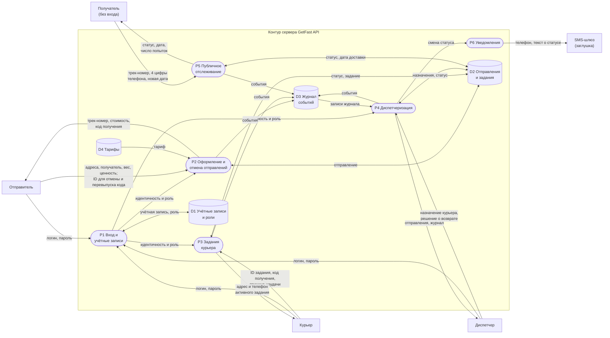

# Модель угроз

Модель построена для продукта из [паспорта](../PROJECT.md) и [требований безопасности](security-requirements.md). Это единственный актуальный архитектурный вид проекта: остальные документы ссылаются на него.

## Модель продукта

Диаграмма потоков данных (DFD) в минимальной нотации. На потоках указаны передаваемые данные, а не протоколы.

**Обозначения:** прямоугольник — внешний субъект; скруглённый блок — процесс; цилиндр — хранилище (в классической DFD — открытый прямоугольник); стрелка — поток данных. Все процессы и хранилища находятся в одном приложении ASP.NET Core и одной базе PostgreSQL; на схеме они разделены по смыслу, потому что различаются полномочия и последствия нарушения.

**Точки входа (план API):**

| Процесс | Методы | Кто вызывает |
| --- | --- | --- |
| P1 | `POST /auth/register`, `POST /auth/login` | все; регистрация — только отправители |
| P2 | `POST /tariffs/quote`, `POST /shipments`, `GET /shipments/my`, `GET /shipments/{id}`, `POST /shipments/{id}/cancel`, `POST /shipments/{id}/code` (перевыпуск кода получения) | отправитель |
| P3 | `GET /courier/tasks`, `GET /courier/tasks/{id}`, `POST /courier/tasks/{id}/pickup`, `POST /courier/tasks/{id}/deliver`, `POST /courier/tasks/{id}/failed`, `POST /courier/tasks/{id}/return` | курьер |
| P4 | `GET /dispatch/shipments`, `POST /dispatch/shipments/{id}/assign`, `POST /dispatch/shipments/{id}/return`, `GET /dispatch/shipments/{id}/events` | диспетчер |
| P5 | `GET /track/{trackNumber}`, `POST /track/{trackNumber}/reschedule` | любой без входа |
| — | `GET /health` | любой |

**Что уже существует:** паспорт, требования безопасности, [проектные решения](design-decisions.md) и [минимальный каркас API](../README.md): `/health`, общий `GetFastDbContext`, подключение к PostgreSQL, Swagger в Development, контейнерный запуск и интеграционные тесты каркаса. Предметных сущностей и миграций пока нет.

**Что пока планируется:** предметные процессы и методы отправлений, D-01 и D-03. Для P1/D1 реализованы Identity, регистрация Sender и вход с JWT, для D-02 — политики ролей и запрет по умолчанию. `/courier/tasks` и `/dispatch/shipments` пока возвращают пустые массивы для проверки ролей. Сущности и миграции отправлений ещё не реализованы.

**Существенные допущения:**

- Подлинность пользователя устанавливается в P1. Дальше сервер берёт идентификатор и роль пользователя из доверенного контекста запроса, а не из параметров. Механизм выбирается на S04. Кража учётных данных у самих пользователей в модели не рассматривается.
- В целевом развёртывании трафик между клиентом и API защищён TLS; при локальном запуске используется HTTP. Перехват трафика не рассматривается.
- База данных доступна только серверу. Администрирование сервера и базы — вне модели.
- Курьеры и диспетчеры аутентифицированы, но не считаются доверенными за пределами своих полномочий: злоупотребление сотрудника — реалистичный сценарий для курьерской службы.
- Физическая передача посылки и проверка личности получателя происходят вне системы. Система фиксирует только факт вручения по коду.
- Продукт запускается локально, публичного развёртывания в рамках курса нет.

## Границы доверия

| Граница | Что пересекает | Почему требуется проверка |
| --- | --- | --- |
| **TB-1.** Отправитель, курьер, диспетчер → P1–P4 | Учётные данные, данные отправления, вес, адреса, ID отправлений и заданий, код получения, назначения | Клиентом управляет пользователь: он может отправить любой запрос напрямую, минуя интерфейс, подставить чужой ID, лишние поля (роль, стоимость) или недопустимые значения. Аутентифицированный запрос остаётся недоверенным вводом |
| **TB-2.** Получатель (анонимный интернет) → P5 | Трек-номер, 4 цифры телефона, новая дата | Вызывающий не аутентифицирован, число запросов не ограничено; трек-номер может знать посторонний (напечатан на этикетке) |
| **TB-3.** Между ролями внутри API (доступ к P3, P4 и D2) | Действия курьера и отправителя, затрагивающие чужие объекты или функции диспетчера | Меняется допустимый набор действий, хотя всё работает в одном приложении. Сотрудник — инсайдер с законным доступом к части данных |
| **TB-4.** P6 → SMS-шлюз | Телефон получателя и текст уведомления | Данные покидают контур продукта и попадают в систему с другим контролем и сроком хранения; в сообщение не должно попасть ничего сверх необходимого, в частности код получения |

## Значимые объекты и свойства

Объекты и последствия нарушения — в [разделе 5 паспорта](../PROJECT.md#5-значимые-данные-и-другие-объекты). На схеме им соответствуют хранилища D1–D4. Для модели главное:

- **конфиденциальность** персональных данных в отправлении и кода получения;
- **целостность** статуса, назначений, стоимости и журнала событий;
- **доступность** доставки: её нельзя сорвать посторонним действием;
- **полномочия** ролей: их нельзя подменить или повысить;
- **подотчётность** действий: должно быть видно, кто вручил, назначил или вернул посылку.

## Угрозы

Все угрозы ниже имеют статус **релевантна**. Шкала приоритета: высокий / средний / низкий — по условиям реализации и тяжести последствий. Условие пересмотра — изменение продукта, при котором запись нужно перечитать.

### T-01. Отправитель открывает или отменяет чужое отправление

- **Сценарий:** отправитель подставляет ID чужого отправления в `GET /shipments/{id}`, `POST /shipments/{id}/cancel` или `POST /shipments/{id}/code` (ID можно подобрать или узнать у знакомого) и получает карточку с адресами и телефонами, перевыпускает и узнаёт новый код получения чужого отправления либо отменяет чужую доставку.
- **Кто или что:** аутентифицированный отправитель.
- **Актив:** отправление и код получения (D2).
- **Нарушаемое свойство:** конфиденциальность персональных данных и кода; целостность статуса; авторизация.
- **Последствие:** раскрытие данных двух людей; с кодом получения — возможность забрать чужую посылку; сорванная доставка.
- **Элемент модели:** поток отправитель → P2, хранилище D2; TB-1, TB-3.
- **Связанные SR:** SR-01, SR-07.
- **Решения:** D-01, D-03 — [проектные решения](design-decisions.md).
- **Статус:** релевантна.
- **Приоритет:** **высокий, в приоритетном наборе.** Условия — достаточно изменить число в запросе; последствия — массовое раскрытие и кража посылки в основном сценарии.
- **Условие пересмотра:** отправления станут общими для нескольких пользователей (например, сотрудники одного магазина) — правило владения меняется.

### T-02. Курьер получает данные и действует вне своих заданий

- **Сценарий:** курьер перебирает ID в `GET /courier/tasks/{id}`, повторно открывает завершённые задания и собирает адреса и телефоны получателей, а также узнаёт, куда и когда едут ценные посылки. Тем же способом он отмечает забор или неудачную попытку по чужому заданию.
- **Кто или что:** аутентифицированный курьер.
- **Актив:** персональные данные в D2, статусы чужих заданий.
- **Нарушаемое свойство:** конфиденциальность; минимизация доступа; целостность статуса.
- **Последствие:** массовый сбор персональных данных, наводка на кражи, ложные статусы чужих посылок.
- **Элемент модели:** поток курьер → P3, хранилище D2; TB-3.
- **Связанные SR:** SR-02, SR-03.
- **Решения:** D-01 — [проектные решения](design-decisions.md).
- **Статус:** релевантна (включает объединённый кандидат K-1, см. ниже).
- **Приоритет:** **высокий, в приоритетном наборе.** Условия — законный доступ к API, злоупотребление незаметно; последствия — массовое раскрытие и связь с кражами.
- **Условие пересмотра:** курьерам разрешат самим выбирать заказы из общего списка — доступ к данным вне назначенных заданий станет частью сценария.

### T-03. Курьер отмечает вручение без получателя, подобрав код

- **Сценарий:** курьер, не встретив получателя, перебирает код получения повторными запросами `POST /courier/tasks/{id}/deliver`, отмечает вручение и присваивает посылку. Статус `доставлено` и запись в журнале скрывают кражу.
- **Кто или что:** назначенный курьер.
- **Актив:** посылка, факт вручения, статус (D2).
- **Нарушаемое свойство:** целостность статуса; подотчётность вручения.
- **Последствие:** кража посылки, служба не может доказать, кому передала посылку.
- **Элемент модели:** поток курьер → P3, хранилища D2 и D3; TB-3.
- **Связанные SR:** SR-06, SR-05, SR-10.
- **Решения:** D-03 — [проектные решения](design-decisions.md).
- **Статус:** релевантна.
- **Приоритет:** **высокий, в приоритетном наборе.** Условия — код короткий, у курьера есть мотив и время, если число попыток не ограничено; последствия — прямой материальный ущерб.
- **Условие пересмотра:** вручение начнут подтверждать иначе (подпись, фото, подтверждение получателем в приложении).

### T-04. Посторонний перебирает трек-номера в публичном отслеживании

- **Сценарий:** посторонний перебирает трек-номера через `GET /track/{trackNumber}`. Если номера идут по порядку, он находит все действующие отправления, а при избыточном ответе собирает имена и адреса.
- **Кто или что:** любой пользователь интернета.
- **Актив:** сведения об отправлениях (D2).
- **Нарушаемое свойство:** конфиденциальность; перечисление объектов.
- **Последствие:** сведения о множестве отправлений, трек-номера для атаки T-05.
- **Элемент модели:** поток получатель → P5 → получатель; TB-2.
- **Связанные SR:** SR-08.
- **Статус:** релевантна.
- **Приоритет:** **средний.** Условия — анонимно и массово; последствия ограничены статусами при минимальном ответе (SR-08).
- **Условие пересмотра:** в ответ отслеживания добавятся новые поля или продукт будет развёрнут публично — приоритет повышается.

### T-05. Посторонний срывает доставку многократными переносами

- **Сценарий:** посторонний, знающий трек-номер (фото этикетки у двери или в подъезде), перебирает 4 последние цифры телефона (10 000 вариантов) в `POST /track/{trackNumber}/reschedule` и раз за разом переносит доставку, пока посылка не уйдёт в возврат.
- **Кто или что:** посторонний без учётной записи.
- **Актив:** дата доставки, возможность получить посылку.
- **Нарушаемое свойство:** доступность доставки; целостность даты.
- **Последствие:** задержка доставки и возврат посылки отправителю.
- **Элемент модели:** поток получатель → P5, хранилище D2; TB-2.
- **Связанные SR:** SR-09.
- **Статус:** релевантна.
- **Приоритет:** **средний.** Условия — реалистично без ограничения попыток; последствия — задержка, а не кража или раскрытие.
- **Условие пересмотра:** получателю без входа разрешат менять адрес или переносить доставку в других статусах — приоритет повышается до высокого.

### T-06. Пользователь повышает свою роль

- **Сценарий:** пользователь повышает свои права: при регистрации передаёт `"role": "dispatcher"`, и сервер привязывает все поля запроса к учётной записи; или курьер напрямую вызывает `POST /dispatch/shipments/{id}/assign`, увидев метод в Swagger, и назначает себе ценные отправления.
- **Кто или что:** отправитель при регистрации или аутентифицированный курьер.
- **Актив:** роли (D1), назначения (D2).
- **Нарушаемое свойство:** авторизация; целостность ролей и назначений.
- **Последствие:** доступ ко всем отправлениям и управление назначениями.
- **Элемент модели:** потоки → P1 и → P4, хранилища D1, D2; TB-1, TB-3.
- **Связанные SR:** SR-03.
- **Решения:** D-02 — [проектные решения](design-decisions.md).
- **Статус:** релевантна.
- **Приоритет:** **высокий, в приоритетном наборе.** Условия — прямой вызов API в обход интерфейса; последствия — одна попытка открывает всё.
- **Условие пересмотра:** появится роль администратора или управление учётными записями через API.

### T-07. Отправитель занижает стоимость доставки

- **Сценарий:** отправитель передаёт в `POST /shipments` поле `cost: 1` или вес 0,001 кг при фактических 20 кг и получает заниженную стоимость.
- **Кто или что:** аутентифицированный отправитель.
- **Актив:** стоимость и тарифы (D2, D4).
- **Нарушаемое свойство:** целостность стоимости.
- **Последствие:** прямой убыток службы.
- **Элемент модели:** поток отправитель → P2; TB-1.
- **Связанные SR:** SR-04.
- **Статус:** релевантна.
- **Приоритет:** **средний.** Условия — просто; последствия ограничены одним отправлением, занижение веса частично замечает курьер при заборе.
- **Условие пересмотра:** в системе появится оплата — приоритет повышается до высокого.

### T-08. Отправитель отменяет или переадресует уже забранную посылку

- **Сценарий:** отправитель вызывает отмену или меняет адрес доставки после того, как курьер забрал посылку (статус проверяется только в интерфейсе): посылка у курьера числится отменённой или уезжает по другому адресу.
- **Кто или что:** отправитель-владелец.
- **Актив:** статус и адрес доставки (D2).
- **Нарушаемое свойство:** целостность статуса и адреса.
- **Последствие:** посылка без учёта, споры, потеря.
- **Элемент модели:** поток отправитель → P2; TB-1.
- **Связанные SR:** SR-05.
- **Статус:** релевантна.
- **Приоритет:** **средний.** Условия — требует активных действий владельца собственного отправления; последствия — потеря учёта, но не раскрытие.
- **Условие пересмотра:** отправителю разрешат переадресацию в пути.

### T-09. Одновременные конфликтующие действия ломают состояние

- **Сценарий:** два конфликтующих запроса приходят почти одновременно: курьер вручает посылку, а диспетчер оформляет возврат, или два диспетчера назначают разных курьеров. Обе проверки статуса проходят до записи, и отправление оказывается в противоречивом состоянии. Злого умысла не требуется.
- **Кто или что:** курьер и диспетчер или два диспетчера при обычной работе.
- **Актив:** статус и назначения (D2), журнал (D3).
- **Нарушаемое свойство:** целостность статуса и назначений; достоверность журнала.
- **Последствие:** посылка одновременно «доставлена» и «в возврате», два курьера едут за одной посылкой.
- **Элемент модели:** потоки курьер → P3 и диспетчер → P4, хранилище D2; TB-3.
- **Связанные SR:** SR-05, SR-10.
- **Решения:** D-03 (частично: конфликт переходов) — [проектные решения](design-decisions.md).
- **Статус:** релевантна.
- **Приоритет:** **средний.** Условия — реалистично при ручной работе диспетчеров, но редко; последствия выявляются при разборе.
- **Условие пересмотра:** назначения станут автоматическими или курьеры будут сами брать задания — вероятность гонок растёт, приоритет повышается.

### T-10. Код получения утекает персоналу

- **Сценарий:** API возвращает карточку отправления диспетчеру вместе с кодом (сериализуется вся сущность), код пишется в журнал событий или попадает в журнал приложения при логировании тела запроса `/deliver`. Сотрудник узнаёт код и отмечает вручение без получателя. Причиной может быть не злой умысел, а ошибка реализации.
- **Кто или что:** диспетчер или курьер, получивший доступ к коду; ошибка разработчика как условие.
- **Актив:** код получения.
- **Нарушаемое свойство:** конфиденциальность кода; смысл проверки вручения.
- **Последствие:** как у T-03, но без перебора.
- **Элемент модели:** поток P4 → диспетчер, хранилище D3, журналы приложения, поток P6 → SMS; TB-3, TB-4.
- **Связанные SR:** SR-07, SR-06.
- **Решения:** D-03 — [проектные решения](design-decisions.md).
- **Статус:** релевантна.
- **Приоритет:** **высокий, в приоритетном наборе.** Условия — логирование тел запросов и сериализация целых сущностей — частая ошибка; последствия — кража посылки.
- **Условие пересмотра:** код начнут отправлять получателю через SMS-шлюз — добавится утечка через внешнюю систему (TB-4).

## Кандидаты, которые не стали отдельными угрозами

Кандидаты найдены проходом STRIDE по потокам и хранилищам схемы. Каждый получил решение.

| Кандидат | Класс STRIDE | Решение | Причина | Условие пересмотра |
| --- | --- | --- | --- | --- |
| K-1. Курьер отмечает забор или неудачную попытку по чужому заданию, подставив его ID | T, E | объединена → T-02 | Тот же субъект, та же точка входа и тот же способ; связь с SR-03 добавлена в T-02 | — |
| K-2. Перехват трафика между клиентом и API | I, T | отброшена | Допущение: TLS в целевом развёртывании; в курсе запуск локальный | Развёртывание без TLS |
| K-3. Раскрытие или подмена платёжных данных | I, T | отброшена | Продукт не принимает и не хранит платёжные данные — такого актива нет | Появление оплаты в системе |
| K-4. Массовые запросы к публичному отслеживанию делают API недоступным | D | отброшена для текущей границы | Продукт запускается локально, публичного развёртывания нет | Публичное развёртывание |
| K-5. Сбой заглушки SMS оставляет получателя без уведомлений | D | отброшена | Уведомления не критичны: статус доступен по трек-номеру, код через SMS не передаётся | Код или обязательные уведомления пойдут через SMS |
| K-6. Прямое изменение журнала в базе данных | T, R | отброшена | Допущение: администрирование сервера и базы вне модели, доступ к базе только у сервера | Появятся администраторы базы вне команды |

## Приоритетный набор

**T-01, T-02, T-03, T-06, T-10.**

Эти угрозы ведут к краже посылки, массовому раскрытию персональных данных или захвату полномочий. Они возникают в основных сценариях и требуют от нарушителя только прямого запроса к API или злоупотребления законным доступом сотрудника. Для них решение нужно уже в архитектуре: где проверяются владелец и назначение, откуда берётся роль, как хранится и проверяется код.

T-04, T-05, T-07, T-08 и T-09 оценены как средние: ущерб ограничен задержкой, одним отправлением или требует редкого совпадения событий. Они остаются в модели и связаны с SR, а при выполнении условия пересмотра их приоритет пересматривается.
