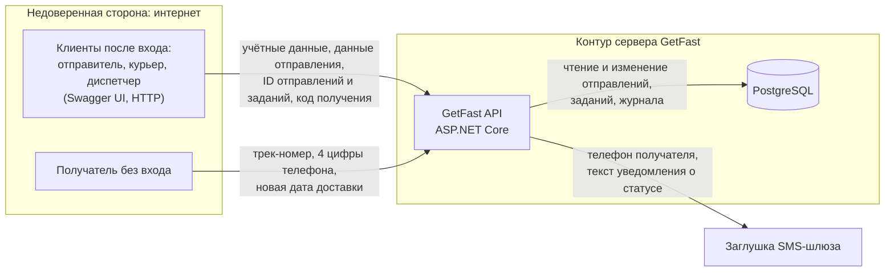

# Модель угроз

Модель построена для продукта из [паспорта](../PROJECT.md) и [требований безопасности](security-requirements.md). Это единственный актуальный архитектурный вид проекта: остальные документы ссылаются на него.

## Модель продукта

Все решения о доступе, стоимости, статусах и проверке кода принимает **GetFast API**. Клиенты только передают запросы, база данных только хранит состояние.

**Точки входа (план API):**

| Группа | Методы | Кто вызывает |
| --- | --- | --- |
| Вход | `POST /auth/register`, `POST /auth/login` | все; регистрация — только отправители |
| Отправления | `POST /tariffs/quote`, `POST /shipments`, `GET /shipments/my`, `GET /shipments/{id}`, `POST /shipments/{id}/cancel` | отправитель |
| Задания курьера | `GET /courier/tasks`, `GET /courier/tasks/{id}`, `POST /courier/tasks/{id}/pickup`, `POST /courier/tasks/{id}/deliver`, `POST /courier/tasks/{id}/failed`, `POST /courier/tasks/{id}/return` | курьер |
| Диспетчерская | `GET /dispatch/shipments`, `POST /dispatch/shipments/{id}/assign`, `POST /dispatch/shipments/{id}/return`, `GET /dispatch/shipments/{id}/events` | диспетчер |
| Публичное отслеживание | `GET /track/{trackNumber}`, `POST /track/{trackNumber}/reschedule` | любой без входа |
| Служебное | `GET /health` | любой |

**Что уже существует:** паспорт и требования безопасности. Кода пока нет.

**Что пока планируется:** все компоненты схемы и перечисленные методы API.

**Существенные допущения:**

- Подлинность пользователя устанавливается при входе. Дальше сервер берёт идентификатор и роль пользователя из доверенного контекста запроса, а не из параметров. Механизм выбирается на S04. Кража учётных данных у самих пользователей в модели не рассматривается.
- В целевом развёртывании трафик между клиентом и API защищён TLS; при локальном запуске используется HTTP. Перехват трафика не рассматривается.
- База данных доступна только серверу. Администрирование сервера и базы — вне модели.
- Курьеры и диспетчеры аутентифицированы, но не считаются доверенными за пределами своих полномочий: злоупотребление сотрудника — реалистичный сценарий для курьерской службы.
- Физическая передача посылки и проверка личности получателя происходят вне системы. Система фиксирует только факт вручения по коду.

## Границы доверия

| Граница | Что пересекает | Почему требуется проверка |
| --- | --- | --- |
| **TB-1.** Клиент после входа → API | Данные отправления, вес, адреса, ID отправлений и заданий, код получения, назначения | Клиентом управляет пользователь: он может отправить любой запрос напрямую, минуя интерфейс, подставить чужой ID, лишние поля (роль, стоимость) или недопустимые значения |
| **TB-2.** Анонимный интернет → публичное отслеживание | Трек-номер, 4 цифры телефона, новая дата | Вызывающий не аутентифицирован, число запросов не ограничено; трек-номер может знать посторонний (напечатан на этикетке) |
| **TB-3.** Между ролями внутри API | Действия курьера и отправителя, затрагивающие чужие объекты или функции диспетчера | Аутентификация подтверждает, кто пользователь, но не даёт права на любое действие. Сотрудник — инсайдер с законным доступом к части данных |
| **TB-4.** API → заглушка SMS | Телефон получателя и текст уведомления | Данные покидают контур продукта; в сообщение не должно попасть ничего сверх необходимого, в частности код получения |

## Значимые объекты и свойства

Объекты и последствия нарушения — в [разделе 5 паспорта](../PROJECT.md#5-значимые-данные-и-другие-объекты). Для модели главное:

- **конфиденциальность** персональных данных в отправлении и кода получения;
- **целостность** статуса, назначений, стоимости и журнала событий;
- **доступность** доставки: её нельзя сорвать посторонним действием;
- **полномочия** ролей: их нельзя подменить или повысить.

## Угрозы

| ID | Сценарий угрозы | Что нарушается | Граница / точка входа | Связанные SR | Приоритет и обоснование |
| --- | --- | --- | --- | --- | --- |
| T-01 | Отправитель подставляет ID чужого отправления в `GET /shipments/{id}` или `POST /shipments/{id}/cancel` (ID можно подобрать или узнать у знакомого) и получает карточку с адресами, телефонами и кодом получения либо отменяет чужую доставку | Конфиденциальность персональных данных и кода; целостность статуса | TB-1, TB-3; `/shipments/{id}` | SR-01, SR-07 | **Высокий, приоритетная.** Основной сценарий, атака требует только изменить число в запросе. Вместе с кодом получения позволяет забрать чужую посылку |
| T-02 | Курьер перебирает ID в `GET /courier/tasks/{id}` или повторно открывает завершённые задания и собирает адреса и телефоны получателей, а также узнаёт, куда и когда едут ценные посылки | Конфиденциальность персональных данных; минимизация доступа | TB-3; `/courier/tasks/{id}` | SR-02 | **Высокий, приоритетная.** Инсайдер с законным доступом к API, массовый сбор данных, прямая связь с кражами посылок |
| T-03 | Курьер, не встретив получателя, перебирает код получения повторными запросами `POST /courier/tasks/{id}/deliver`, отмечает вручение и присваивает посылку. Статус `доставлено` и запись в журнале скрывают кражу | Целостность статуса; неотказуемость вручения | TB-3; `/deliver` | SR-06, SR-05, SR-10 | **Высокий, приоритетная.** Прямой материальный ущерб. Код короткий, у курьера есть и мотив, и неограниченное время, если число попыток не ограничено |
| T-04 | Посторонний перебирает трек-номера через `GET /track/{trackNumber}`. Если номера идут по порядку, он находит все действующие отправления, а при избыточном ответе собирает имена и адреса | Конфиденциальность; перечисление объектов | TB-2; `/track/{trackNumber}` | SR-08 | **Средний.** Анонимно и массово, но при минимальном ответе (SR-08) раскрываются только статусы. Опасность растёт в связке с T-05 |
| T-05 | Посторонний, знающий трек-номер (фото этикетки у двери или в подъезде), перебирает 4 последние цифры телефона (10 000 вариантов) в `POST /track/{trackNumber}/reschedule` и раз за разом переносит доставку, пока посылка не уйдёт в возврат | Доступность доставки; целостность даты доставки | TB-2; `/reschedule` | SR-09 | **Средний.** Реалистично без ограничения попыток, но ущерб — задержка и возврат, а не кража или раскрытие |
| T-06 | Пользователь повышает свои права: при регистрации передаёт `"role": "dispatcher"`, и сервер привязывает все поля запроса к учётной записи; или курьер напрямую вызывает `POST /dispatch/shipments/{id}/assign`, увидев метод в Swagger, и назначает себе ценные отправления | Полномочия ролей; целостность назначений | TB-1, TB-3; `/auth/register`, `/dispatch/*` | SR-03 | **Высокий, приоритетная.** Одна успешная попытка открывает все отправления и управление назначениями. Прямые вызовы API в обход интерфейса — самый доступный способ атаки |
| T-07 | Отправитель передаёт в `POST /shipments` поле `cost: 1` или вес 0,001 кг при фактических 20 кг и получает заниженную стоимость | Целостность стоимости | TB-1; `/shipments`, `/tariffs/quote` | SR-04 | **Средний.** Финансовый ущерб ограничен одним отправлением; занижение веса частично замечает курьер при заборе |
| T-08 | Отправитель вызывает отмену или меняет адрес доставки после того, как курьер забрал посылку (статус проверяется только в интерфейсе): посылка у курьера числится отменённой или уезжает по другому адресу | Целостность статуса и адреса | TB-1; `/shipments/{id}/cancel` | SR-05 | **Средний.** Ведёт к спорам и потере учёта, но требует активных действий владельца собственного отправления |
| T-09 | Два конфликтующих запроса приходят почти одновременно: курьер вручает посылку, а диспетчер оформляет возврат, или два диспетчера назначают разных курьеров. Обе проверки статуса проходят до записи, и отправление оказывается в противоречивом состоянии | Целостность статуса и назначений; достоверность журнала | TB-3; `/deliver`, `/dispatch/.../assign`, `/dispatch/.../return` | SR-05, SR-10 | **Средний.** Не требует злого умысла и реалистично при ручной работе диспетчеров, но возникает редко, а последствия выявляются при разборе |
| T-10 | Код получения утекает персоналу: API возвращает карточку отправления диспетчеру вместе с кодом (сериализуется вся сущность), код пишется в журнал событий или попадает в журнал приложения при логировании тела запроса `/deliver`. Сотрудник узнаёт код и отмечает вручение без получателя | Конфиденциальность кода; смысл проверки вручения | TB-3, TB-4; `/dispatch/shipments`, журналы | SR-07, SR-06 | **Высокий, приоритетная.** Последствия как у T-03, но без перебора. Логирование тел запросов и сериализация целых сущностей — частая ошибка реализации |

## Приоритетный набор

**T-01, T-02, T-03, T-06, T-10.**

Эти угрозы ведут к краже посылки, массовому раскрытию персональных данных или захвату полномочий. Они возникают в основных сценариях и требуют от нарушителя только прямого запроса к API или злоупотребления законным доступом сотрудника. Для них решение нужно уже в архитектуре: где проверяются владелец и назначение, откуда берётся роль, как хранится и проверяется код.

T-04, T-05, T-07, T-08 и T-09 оценены как средние: ущерб ограничен задержкой, одним отправлением или требует редкого совпадения событий. Они остаются в модели и связаны с SR, а при изменении продукта их приоритет пересматривается.
